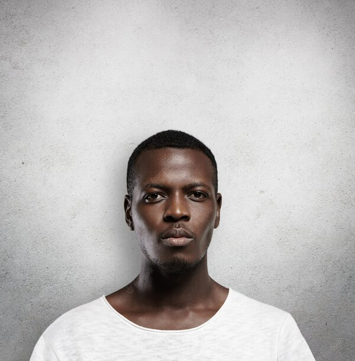
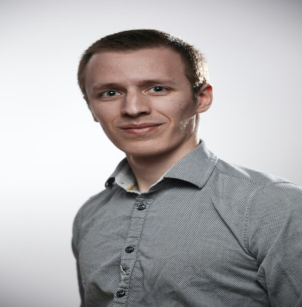

# Especificações do Projeto

Pré-requisitos: <a href="01-Documentação de Contexto.md"> Documentação de Contexto</a>

A definição exata do problema e os pontos mais relevantes a serem tratados neste projeto foi consolidada com a participação dos usuários em um trabalho de imersão feita pelos membros da equipe a partir da observação dos usuários em seu local natural e por meio de entrevistas. Os detalhes levantados nesse processo foram consolidados na forma de personas e histórias de usuários. 

## Personas

As personas levantadas durante o processo de entendimento do problema são apresentadas na Figuras que se seguem. 
 
<table>
 <tbody>
  <tr>
   <td rowspan="3"></td>
   <td colspan="3"><strong>Maycon Lucas</strong></td>
  </tr>
  
  <tr>
   <td>20 Anos</td>
   <td>Belo Horizonte</td>
   <td>Atendente</td>
  </tr>
  
  <tr>
   <td colspan="3">
    <strong>Personalidade</strong>: Competitivo, Determinado, Focado.
   </td>
  </tr>
  
  <tr>
   <td colspan="4">
    <strong>Biografia</strong>: Estudante do ensino médio, desenvolvendo habilidades para se capacitar e ingressar no mundo dos E-sports.
   </td>
  </tr>
  
  <tr>
   <td colspan="4">
    <strong>Objetivos</strong>: Buscar experiência competitiva e se tornar um jogador profissional.
   </td>
  </tr>
  
  <tr>
   <td colspan="4">
    <strong>Pontos de dor e frustração</strong>: Falta de organização de times, dificuldade de encontrar jogadores compatíveis, Falta de sites que promovam a interação entre jogadores.
   </td>
  </tr>
  
  <tr>
   <td colspan="4">
    <strong>Necessidades e expectativas</strong>: Adquirir experiência para entrar no cenário profissional, sites que promovam interação entre os jogadores.
   </td>
  </tr>
 </body>
<table>
 
<table>
 <tbody>
  <tr>
   <td rowspan="3"></td>
   <td colspan="3"><strong>Caroline Soares </strong></td>
  </tr>
  
  <tr>
   <td>25 Anos</td>
   <td>São Paulo</td>
   <td>Gerente de restaurante</td>
  </tr>
  
  <tr>
   <td colspan="3">
    <strong>Personalidade</strong>: Determinada, Curiosa, Racional, Inspirada, Convincente.
   </td>
  </tr>
  
  <tr>
   <td colspan="4">
    <strong>Biografia</strong>: Estudante do ensino superior da área de tecnologia buscando uma oportunidade de criar um time e ingressar no cenário profissional.
   </td>
  </tr>
  
  <tr>
   <td colspan="4">
    <strong>Objetivos</strong>: Ser uma empreendedora na área de E-Sports criando uma equipe para competir profissionalmente.
   </td>
  </tr>
  
  <tr>
   <td colspan="4">
    <strong>Pontos de dor e frustração</strong>: Dificuldade de encontrar jogadores e dificuldade de encontrar torneios amadores.
   </td>
  </tr>
  
  <tr>
   <td colspan="4">
    <strong>Necessidades e expectativas</strong>: Adquirir experiência no cenário competitivo e gerenciar sua equipe.
   </td>
  </tr>
 </body>
<table>
 
<table>
 <tbody>
  <tr>
   <td rowspan="3"></td>
   <td colspan="3"><strong>Filipe Fidelis</strong></td>
  </tr>
  
  <tr>
   <td>28 Anos</td>
   <td>Rio de Janeiro</td>
   <td>Proprietário de delivery</td>
  </tr>
  
  <tr>
   <td colspan="3">
    <strong>Personalidade</strong>: Comprometido, proativo, detalhista, organizado, disciplinado, focado.
   </td>
  </tr>
  
  <tr>
   <td colspan="4">
    <strong>Biografia</strong>: Graduado em Ciência Contábeis, trabalha a 7 anos no mercado financeiro. Nos momentos de lazer gosta de jogar vídeo games.
   </td>
  </tr>
  
  <tr>
   <td colspan="4">
    <strong>Objetivos</strong>: Buscar por equipes sem interesse em competições, somente jogos casuais.
   </td>
  </tr>
  
  <tr>
   <td colspan="4">
    <strong>Pontos de dor e frustração</strong>: Dificuldade de encontrar jogadores.
   </td>
  </tr>
  
  <tr>
   <td colspan="4">
    <strong>Necessidades e expectativas</strong>: Buscar novas amizades.
   </td>
  </tr>
 </body>
<table>

## Histórias de Usuários

A partir da compreensão do dia a dia das personas identificadas para o projeto, foram registradas as seguintes histórias de usuários. 

|EU COMO... `PERSONA`| QUERO/PRECISO ... `FUNCIONALIDADE`                                 |PARA ... `MOTIVO/VALOR`                                              |
|--------------------|--------------------------------------------------------------------|---------------------------------------------------------------------|
|Maycon Lucas        |                                                                    |                                                                     |
|Maycon Lucas        |                                                                    |                                                                     |
|Maycon Lucas        |                                                                    |                                                                     |
|Filipe Fidelis      |                                                                    |                                                                     |
|Filipe Fidelis      |                                                                    |                                                                     |
|Filipe Fidelis      |                                                                    |                                                                     |
|Caroline Soares     |                                                                    |                                                                     |
|Caroline Soares     |                                                                    |                                                                     |
|Caroline Soares     |                                                                    |                                                                     |

## Requisitos

O escopo funcional do projeto é definido por meio dos requisitos funcionais que descrevem as possibilidades interação dos usuários, bem como os requisitos não funcionais que descrevem os aspectos que o sistema deverá apresentar de maneira geral. Estes requisitos são apresentados a seguir. 

### Requisitos Funcionais

|ID&nbsp;&nbsp;&nbsp;&nbsp;&nbsp;&nbsp;&nbsp;&nbsp;&nbsp;&nbsp;     | Descrição do Requisito  | Prioridade |
|-------|-----------------------------------------|----|
|RF-01| Digite o requisito | ALTA | 
|RF-02| Digite o requisito |  MÉDIA | 
|RF-03| Digite o requisito |  ALTA | 
|RF-04| Digite o requisito|  ALTA | 
|RF-05| Digite o requisito |  ALTA | 
|RF-06| Digite o requisito |  BAIXA |

### Requisitos não Funcionais

| ID&nbsp;&nbsp;&nbsp;&nbsp;&nbsp;&nbsp;&nbsp;&nbsp;&nbsp;&nbsp;        | Descrição do Requisito  |Prioridade |
|-----------|-------------------------|----|
|RNF-01     | Digite o requisito | ALTA | 
|RNF-02     | Digite o requisito | ALTA | 
|RNF-03     | Digite o requisito | ALTA | 
|RNF-04     | Digite o requisito | ALTA | 

## Restrições

O projeto está restrito pelos itens apresentados na tabela a seguir.

|ID| Restrição                                             |
|--|-------------------------------------------------------|
|01| Digite a restrição |
|02| Digite a restrição |
|03| Digite a restrição |
